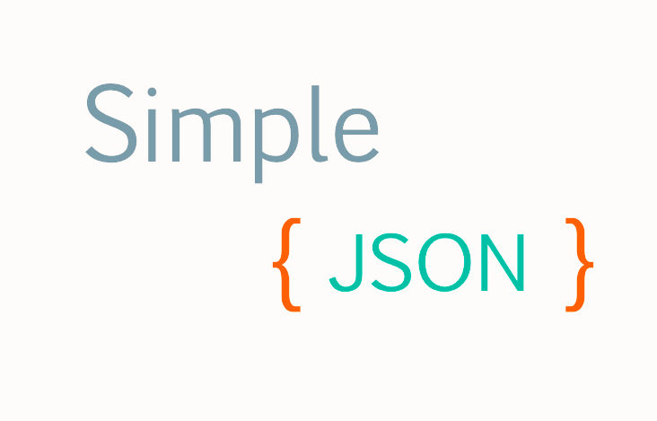

# Simple-Json
  
A light json parser written in Lua  
## How to use
```lua
json = require"json"
```  
## Functions
`json.decode(str)`  
str : The json string  
Return : Decoded table / error  
  
`json.encode(table)`  
table : The table going to encode to json  
Return : JSON string  
  
`json.tostring(table)`  
table : A common table  
Return : A readable string  
  
`json.parse(str)`  
str : JSON element  
Return : Parsed value  
